<!-- ═══════════════════════════════════════════════════════════════════════ -->
<!--                          BANNER                                       -->
<!-- ═══════════════════════════════════════════════════════════════════════ -->

  

<!-- ═══════════════════════════════════════════════════════════════════════ -->
<!--                        TYPING SVG                                     -->
<!-- ═══════════════════════════════════════════════════════════════════════ -->

  

<!-- ═══════════════════════════════════════════════════════════════════════ -->
<!--                       SOCIAL LINKS                                    -->
<!-- ═══════════════════════════════════════════════════════════════════════ -->

  &nbsp;
  &nbsp;
  
   
  

<!-- ═══════════════════════════════════════════════════════════════════════ -->
<!--              BASE (left) + NOTABLE & LANGUAGES stacked (right)        -->
<!-- ═══════════════════════════════════════════════════════════════════════ -->

<table align="center" border="0" cellpadding="0" cellspacing="0">
  <tr>
    <td width="50%" valign="top">
      
    </td>
    <td width="50%" valign="top">
      
      
    </td>
  </tr>
</table>

<!-- ═══════════════════════════════════════════════════════════════════════ -->
<!--                         TOPICS (full width)                           -->
<!-- ═══════════════════════════════════════════════════════════════════════ -->

  

<!-- ═══════════════════════════════════════════════════════════════════════ -->
<!--                  CODING HABITS + ISOMETRIC CALENDAR                   -->
<!-- ═══════════════════════════════════════════════════════════════════════ -->

  
  

<!-- ═══════════════════════════════════════════════════════════════════════ -->
<!--                     PINNED REPOSITORIES (3 in a row)                  -->
<!-- ═══════════════════════════════════════════════════════════════════════ -->

<h2 align="center">📌 Pinned Repositories</h2>

  
  
  

<!-- ═══════════════════════════════════════════════════════════════════════ -->
<!--                          FOOTER                                       -->
<!-- ═══════════════════════════════════════════════════════════════════════ -->

  

  <i>"The only way to do great work is to love what you do."</i>

